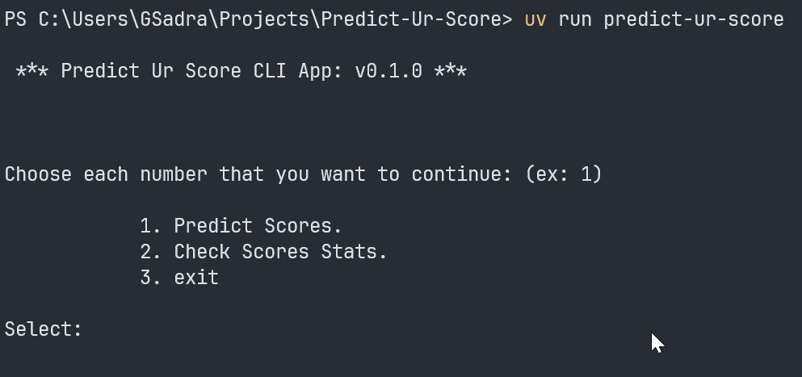
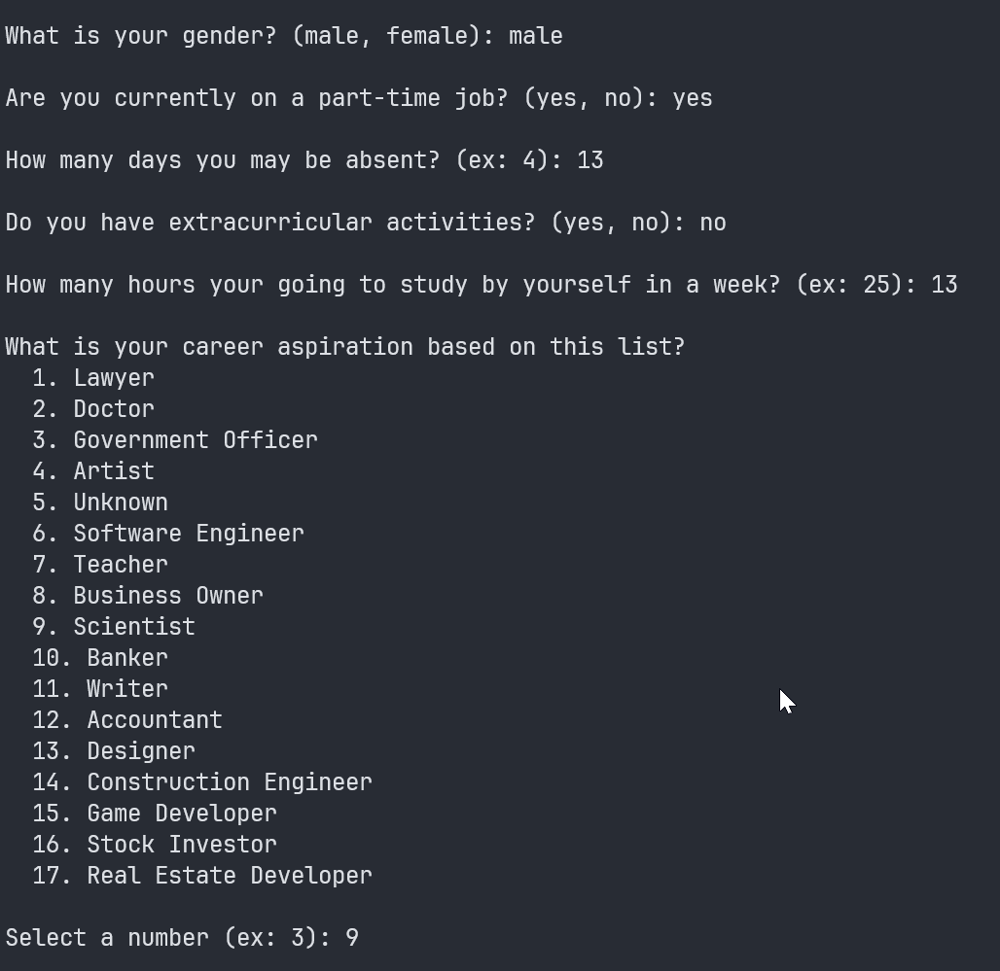
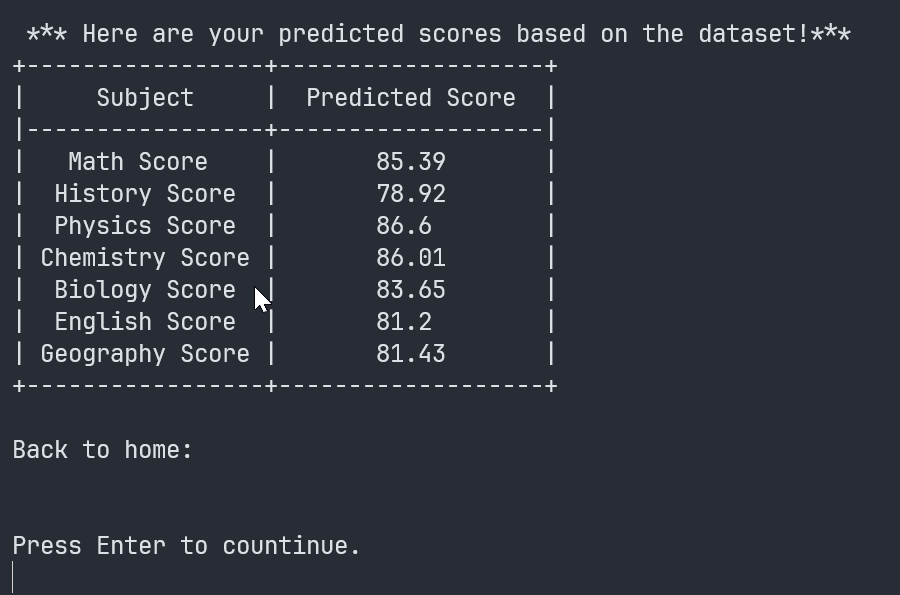
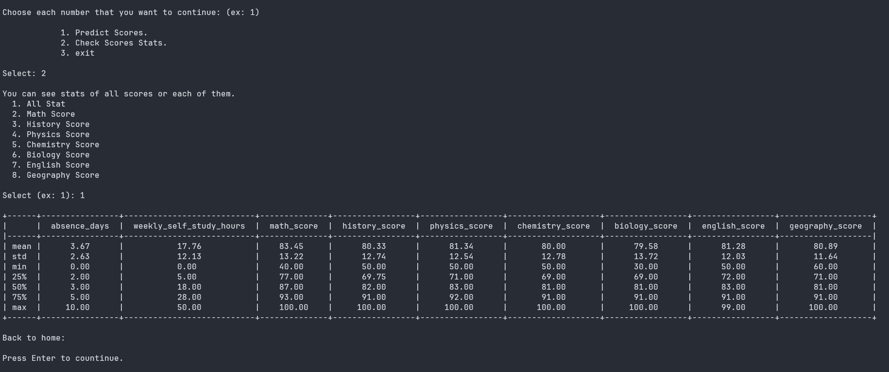

# Predict Ur Score CLI v0.1.0

Answer some questions to sea your probable scores on each course based on a score dataset!
This predictor predict your score using a Machine Learning, Random Forest Regressor model.

## Features

- **Student Score Prediction:** Predict scores for seven courses based on the student's information.
- **Score Stats:** View Statistical information about scores.
- **Intractive CLI:** Collects student through a command-line interface.
- **Input Validation:** Validate collected input from users.
- **Machine Learning Prediction:** Predict scores based on a Machine Learning algorithm.
- **Multiple Output Prediction:** Predicts scores for Mathematics, History, Physics, Chemistry, Biology, English, and Geography.
- **EDA:** Exploretory data analysis for model evaluation and preprocessing.
- **Model Validation & Evaluation:** Validate and Evaluate model before writing a pipline and train the model.
- **Date Preprocessing:** Automatically preprocesses numerical and categorical features before training.
- **Random Forest Regressor Model:** Use the best model training model based on the model evaluations.
- **Model Training:** Traind the model and save the learning pipline and loads it for future predictions.
- **Automated Testing:** including test for methodes and function ussing `pytest`

## Deployment

### 1. Install uv

First, install the uv Package manager:

```bash
pip install uv
```
### 2. Clone the repository:

Clone the project from Github:

```bash
  git clone https://github.com/gsadra/Predict_Ur_Score.git
  cd Predict_Ur_Score
```
### 3. Install dependencies

Install the uv dependencies using uv:

```bash
uv sync
```
### 4. Run the CLI app

Start the CLI with:

```bash
uv run predict-ur-score
```

## CLI Interfase & Usage

### Home



### Answers & Prediction




### Stats



## How It Works

This CLI predictor use the student score dataset to predict your scores based on the performance of the other student. Simply, when you answer questions you give the model the inputs and the predictor based on the model gives you the predicted scores.

## Machine Learning

The application uses a Random Forest Regressor to predict scores for:

- Math
- History
- Physics
- Chemestry
- Biology
- English
- Geography

Thge model uses student information such as:

- Gender 
- Part-time job
- Abcense days
- Extracurricular activities
- Weekly self-study hours
- Career asspirations based on a list

## Testing

Run the test suit with:

```bash
uv run pytest
```
## Code Quality

Check the code with ruff:

```bash
uv run ruff check .
```

Check Formatting:

```bash
uv run ruff foramt --check .
```

Check types  with MyPy:

```bash
uv run mypy src
```

## License

Under the MIT License